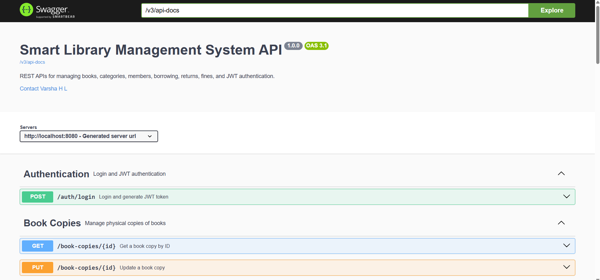
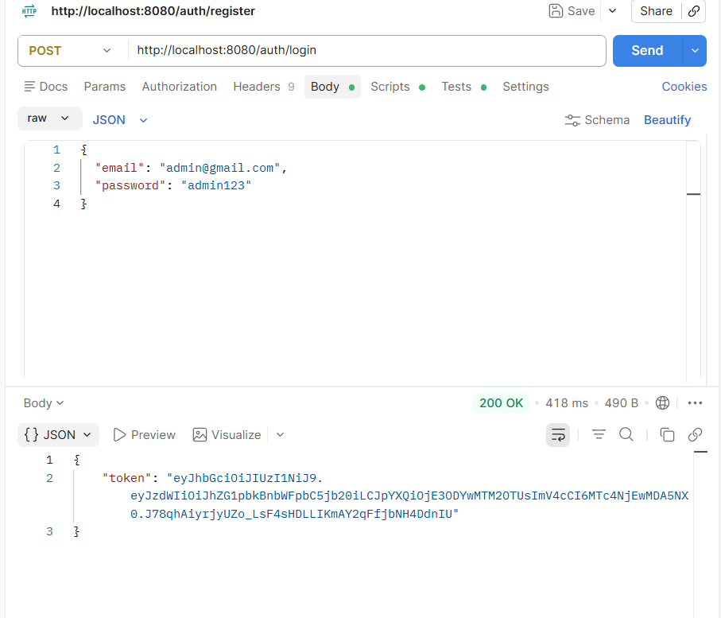
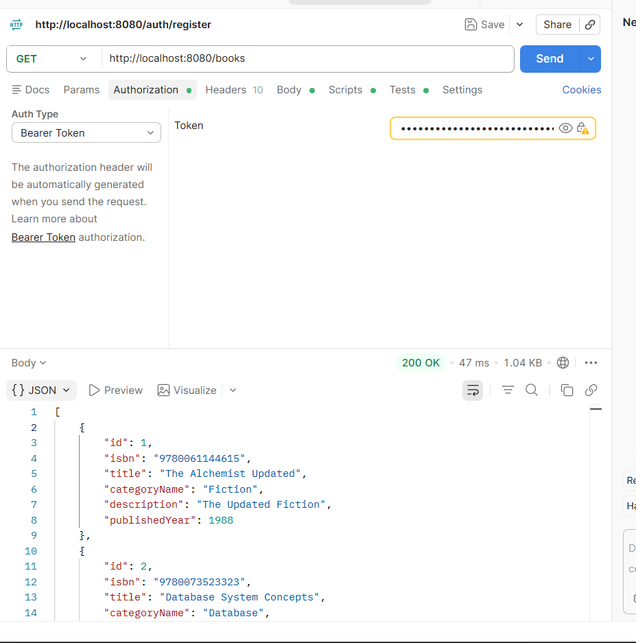
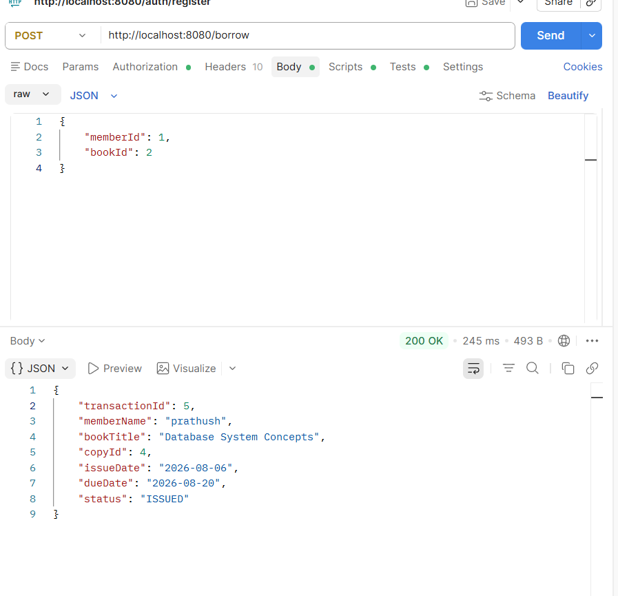
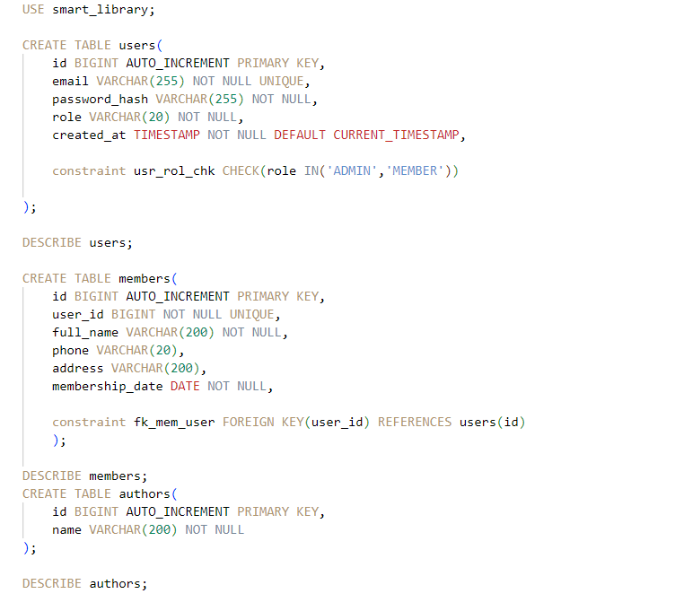
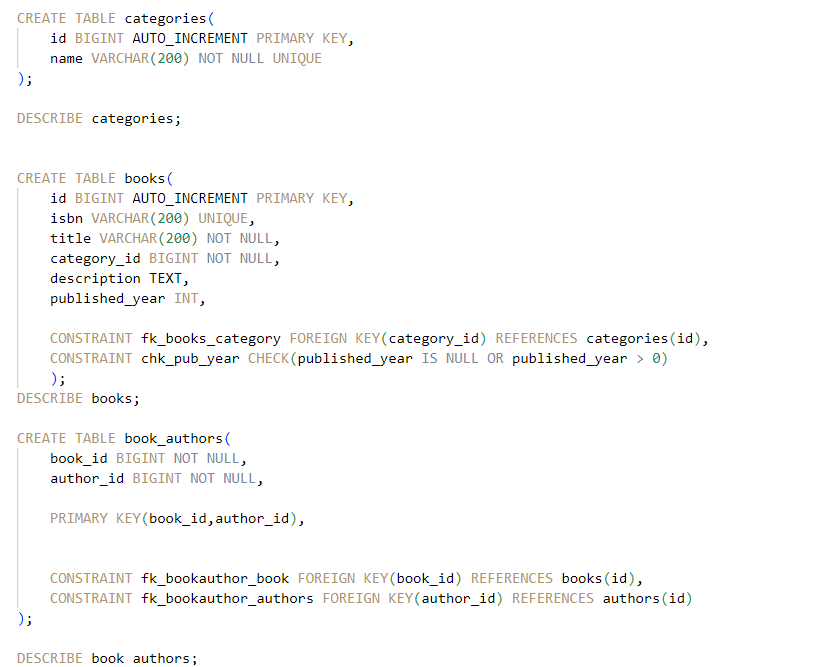
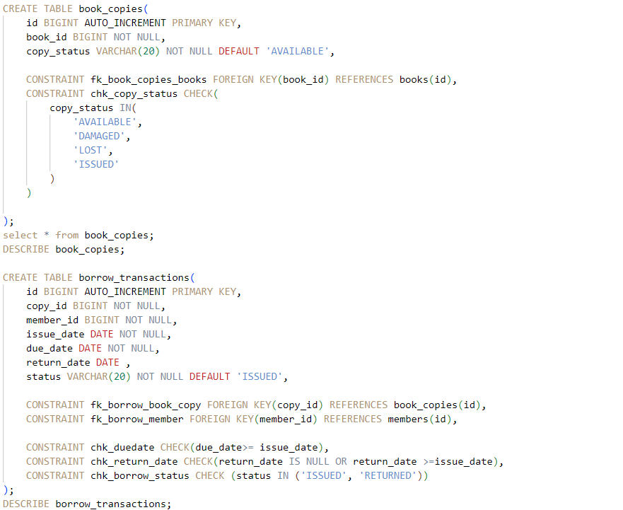
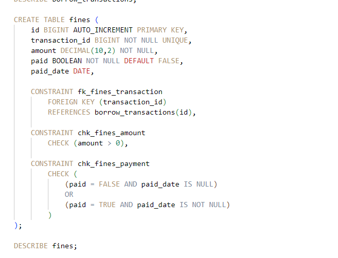
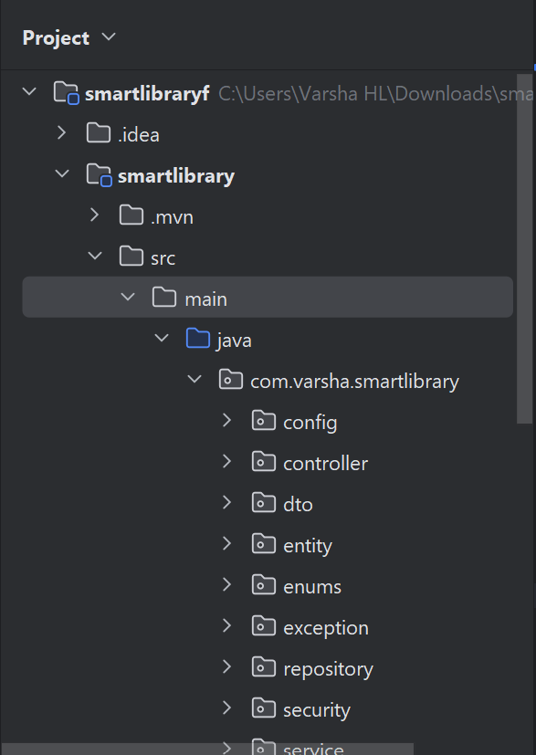

# 📚 Smart Library Management System

A secure **Library Management System** built using **Spring Boot**, **Spring Security**, **JWT Authentication**, **Hibernate**, and **MySQL**. This project provides a complete backend solution for managing books, categories, members, borrowing, returns, and fines with secure role-based access control.

---

# 📖 About the Project

The Smart Library Management System is a RESTful web application developed to automate library operations. It allows administrators and librarians to efficiently manage books, categories, book copies, and members, while enabling members to borrow and return books securely.

The application follows modern backend development practices including JWT authentication, role-based authorization, DTO architecture, exception handling, validation, and API documentation using Swagger.

---

# ✨ Features

### 🔐 Authentication & Security
- User Registration
- JWT Authentication
- BCrypt Password Encryption
- Role-Based Authorization
- Secure REST APIs

### 👥 User Roles
- ADMIN
- LIBRARIAN
- MEMBER

### 📚 Book Management
- Add Book
- View Books
- Update Book
- Delete Book

### 🏷 Category Management
- Create Categories
- View Categories
- Update Categories
- Delete Categories

### 📦 Book Copy Management
- Add Physical Book Copies
- Update Copy Status
- Delete Book Copies

### 📖 Borrow & Return
- Borrow Available Books
- Return Borrowed Books
- Automatic Due Date Generation

### 💰 Fine Management
- Automatic Fine Calculation
- Fine Payment Tracking

### 📑 API Documentation
- Swagger (OpenAPI)

---

# 🛠️ Tech Stack

| Technology | Used |
|------------|------|
| Java | 21 |
| Spring Boot | ✔ |
| Spring Security | ✔ |
| JWT Authentication | ✔ |
| Spring Data JPA | ✔ |
| Hibernate | ✔ |
| MySQL | ✔ |
| Maven | ✔ |
| Swagger / OpenAPI | ✔ |
| IntelliJ IDEA | ✔ |
| Postman | ✔ |

---

# 🗄️ Database Design

The project uses a relational MySQL database consisting of the following tables:

- Users
- Members
- Categories
- Books
- Book Copies
- Borrow Transactions
- Fines

### Relationships

- One Category → Many Books
- One Book → Many Book Copies
- One Member → Many Borrow Transactions
- One Borrow Transaction → One Fine

The database maintains referential integrity using foreign key constraints.

---

# 🔒 Authentication & Authorization

The project uses **JWT (JSON Web Token)** for authentication.

### User Roles

### ADMIN
- Manage Users
- Manage Categories
- Manage Books
- Manage Book Copies
- Borrow & Return Books

### LIBRARIAN
- Manage Categories
- Manage Books
- Manage Book Copies
- Borrow & Return Books

### MEMBER
- View Books
- Borrow Books
- Return Books

Passwords are securely stored using **BCrypt Password Encoder**.

---

# 📑 API Documentation (Swagger)

Swagger has been integrated for interactive API documentation.

After running the application, open:

```text
http://localhost:8080/swagger-ui/index.html
```

Swagger allows developers to:

- View all available REST APIs
- Test endpoints directly
- View request & response formats
- Authenticate using JWT

---

# 📸 Screenshots

## Swagger UI



## Login API



---

## Books API



---

## Borrow Book API



---

## Database Tables









---

# ▶️ Installation & Setup

## 1. Clone Repository

```bash
git clone https://github.com/your-username/smart-library-management-system.git
```

---

## 2. Create Database

```sql
CREATE DATABASE smart_library;
```

---

## 3. Configure application.properties

```properties
spring.datasource.url=jdbc:mysql://localhost:3306/smart_library
spring.datasource.username=YOUR_USERNAME
spring.datasource.password=YOUR_PASSWORD

jwt.secret=YOUR_SECRET_KEY
jwt.expiration=86400000
```

---

## 4. Build Project

```bash
mvn clean install
```

---

## 5. Run Application

```bash
mvn spring-boot:run
```

---

# 📂 Project Structure

```

src
 ├── config
 ├── controller
 ├── dto
 ├── entity
 ├── enums
 ├── exception
 ├── repository
 ├── security
 ├── service
 └── SmartLibraryApplication.java
```

---

# 🚀 Future Improvements

- Email Notifications
- Book Reservation System
- Dashboard & Analytics
- Payment Gateway Integration
- Docker Support
- Unit & Integration Testing
- Cloud Deployment (AWS)

---

# 👩‍💻 Author

**Varsha H L**

Computer Science Engineering Student


---

